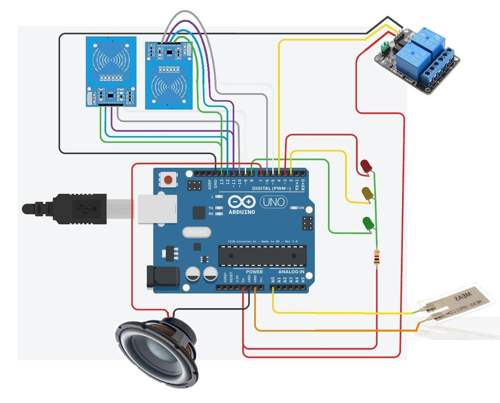

# NFC Switch Project

## WHO?

Benjamin Haos

## WAT?

An Arduino programmed to switch a relay when two nfc tags are present.

## WEN?

Spring 2016

## WER?

* [Presented](slides_basic-electronics-engineering/index.html) at Ewha Womans University.
* Github [Repository](https://github.com/EntropyHaos/project_nfc_switch)

## WHY?

Semester Project

## HOW?

### Parts

* Arduino
* Relay
* NFC Readers (x2)
* Piezo Sensor
* Misc. led and resistors.

View [Project](https://github.com/EntropyHaos/project_nfc_switch) on GitHub.
